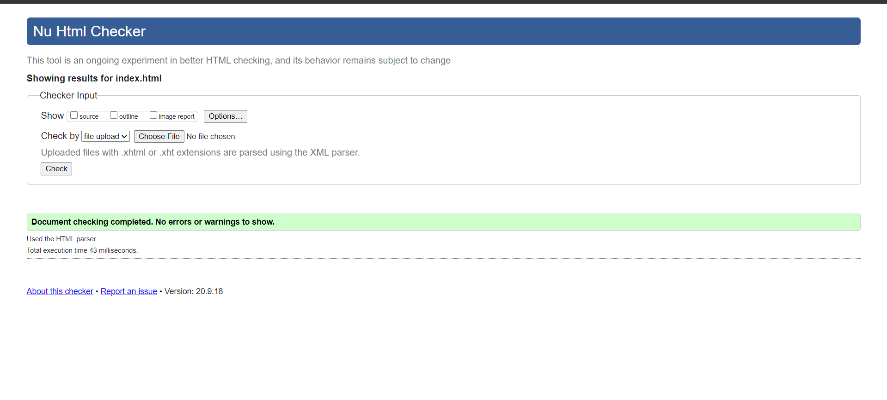
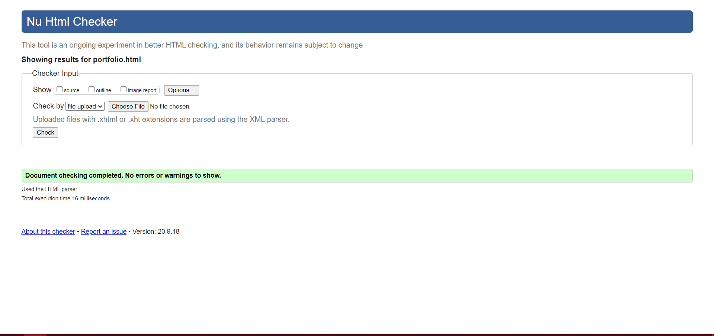
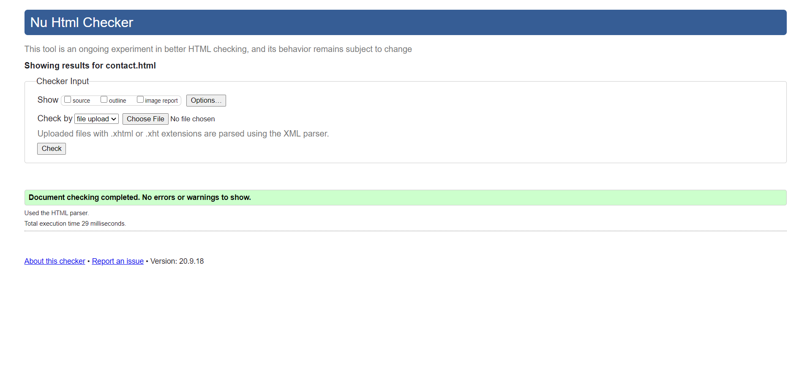
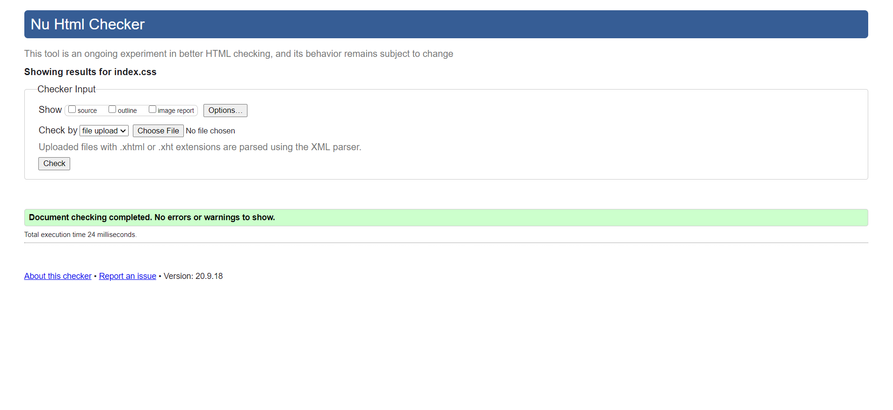
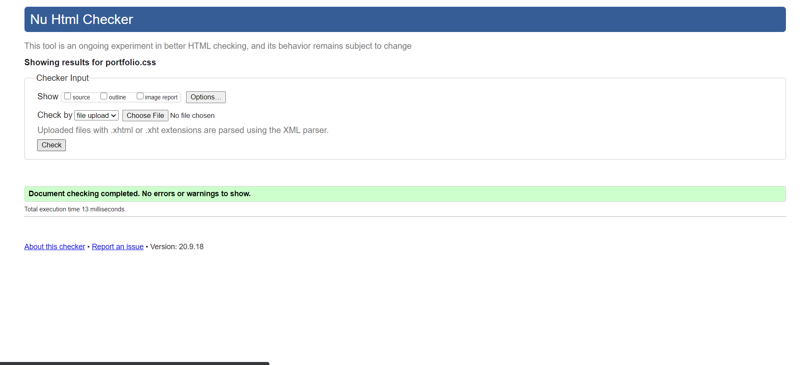
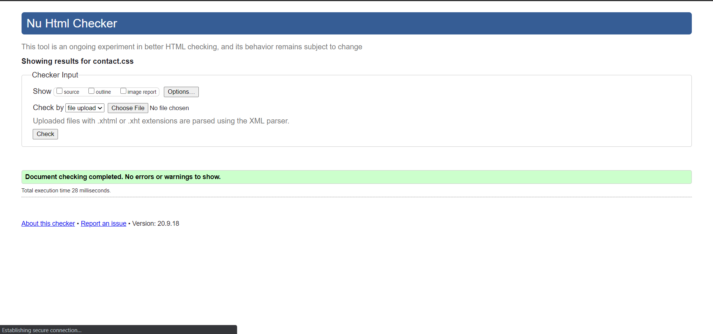
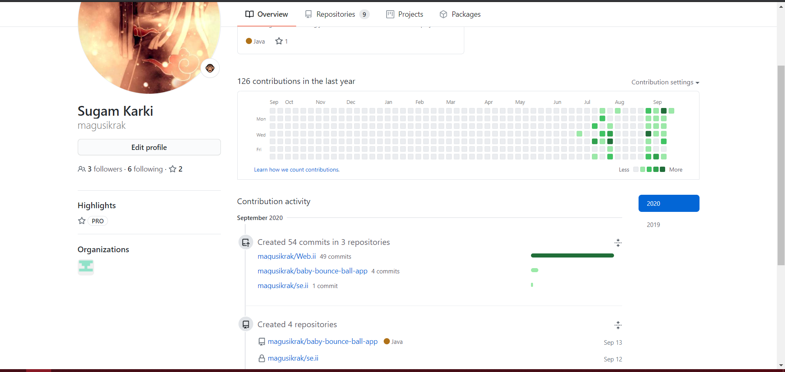

# ___Web Development Term II___
### ***This is the assignment report of *Web Development Term II* where we have to make a portfolio site using HTML, CSS and vanilla Javascript.***
---
---
---
## ___Validation___
All the HTML and CSS files have been properly validated using the pre-approved validator tool.

>## ___HTML___
>### **Index.html**
>  
>### **Cv.html**
>
>### **Portfolio.html**
>
>### **Contact.html**
>

>## CSS
>### **Index.css**
>  
>### **Cv.css**
>
>### **Portfolio.css**
>
>### **Contact.css**
>
-----
---
---
## ___GitHub Version Control Skill___
> ### Heatmap of my Github Profile
>
---
---
---
## __*Commenting*__
>All the HTML, CSS and Javascript files have been thoroughly commented throughout the project.

